# Desafio Dataset Titanic

## Objetivo

Este projeto foi feito com intuito de ser um teste e desafio, para desenvolver uma experiência inicial de DataScience e compreender de forma amador um projeto simples.

**Foco do projeto:**

- Prever a probabilidade de sobrevivência
- Analisar alguns fatores que influenciaram a sobrevivência
- Identificar os grupos de passageiros mais vulneráveis
- Comparar diferentes algoritmos de machine learning

## Tecnologias Usadas

### Back-End

- Python
- Pandas
- Scikit-Learn
- Numpy

### Plotagem

- Matplotlib
- Seaborn

### Modelos/Algoritmos

- Random Forest
- Logistic Regression
- Gaussian Naïve Bayes/GaussianNB
- KNeighbors
- Support Vector Machine/SVM

## Mensurações

### Sobrevivência pelos fatores [Classe, Embarcação, Faixa Etária e Sexo/Gênero]

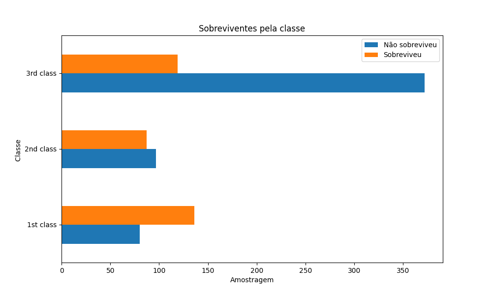
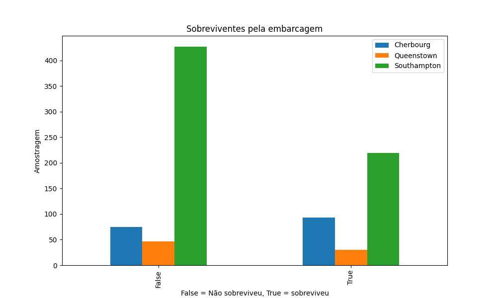
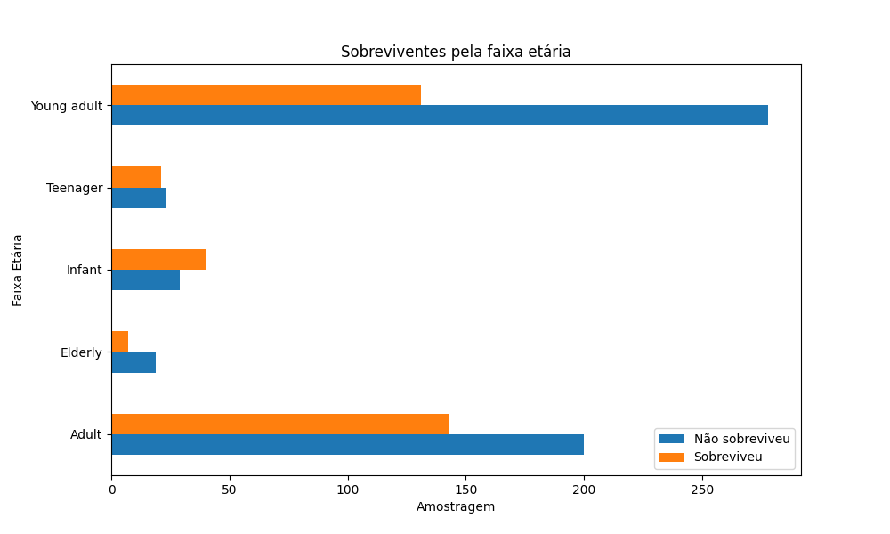
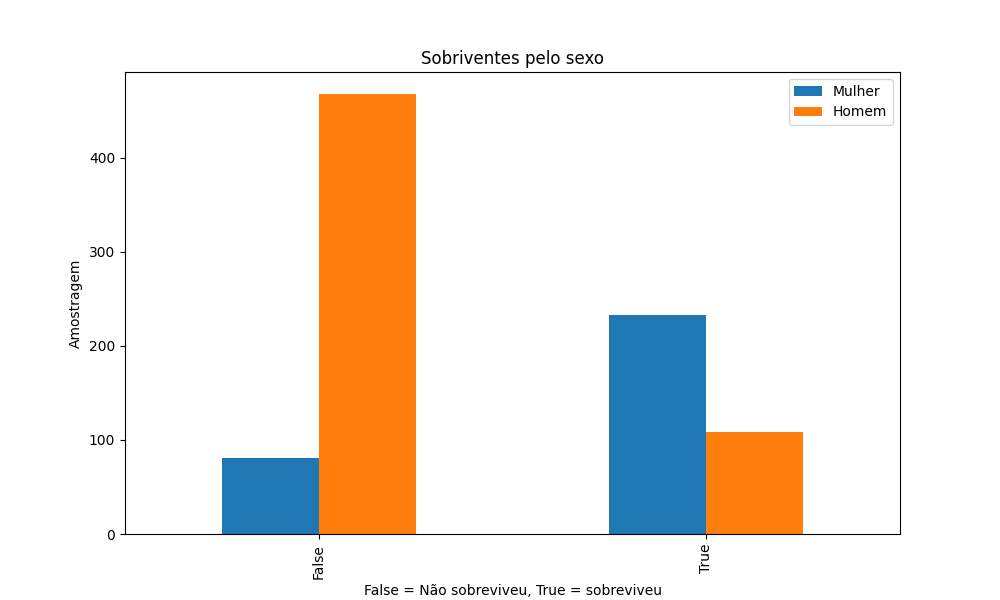

## Avaliações dos Modelos

### Gráficos para cada Modelo

- AUC/Area Under the Curve
- Matriz de confusão

### Random Forest

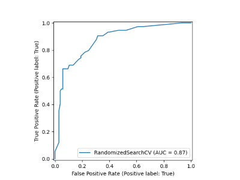 

### Logistic Regression

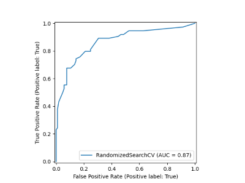 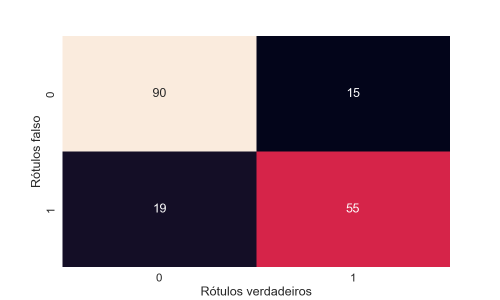

### GaussianNB

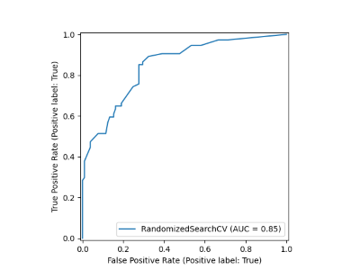 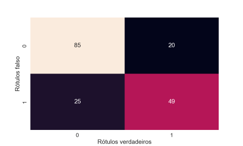

### KNeighbors

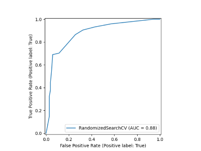 

### SVM/LinearSVC

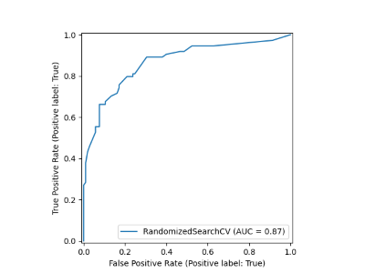 

### Gráficos Finais

- Classification Report entre os Modelos (Sobreviveu ou Não Sobreviveu - True ou False)
- Accuracy entre os Modelos

**Modelos:**

- GNB - GaussianNB
- LR - Logistic Regression
- KN - KNeighbors
- RF - Random Forest
- LSVC - LinearSVC/SVM

### Classification Report

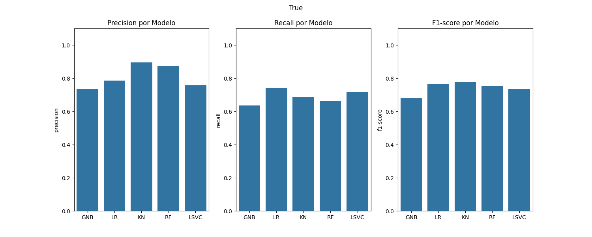 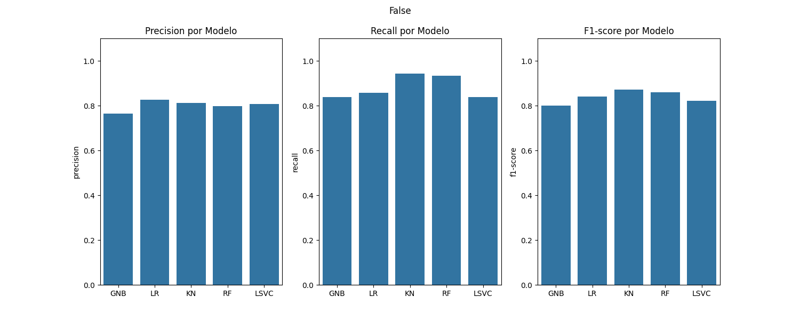

### Accuracy

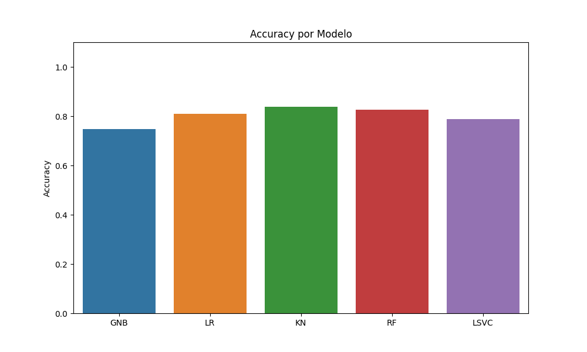

## Material Usado

Dataset Titanic - <https://www.kaggle.com/datasets/yasserh/titanic-dataset>
